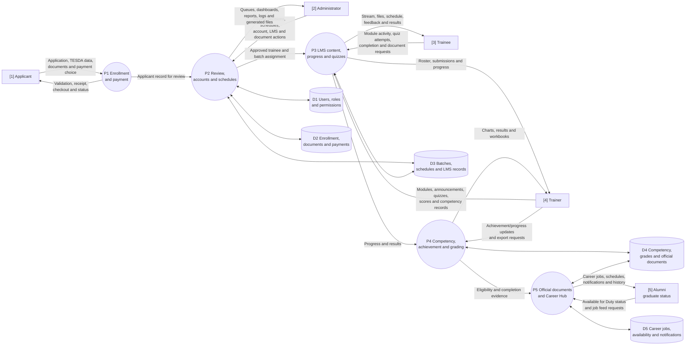
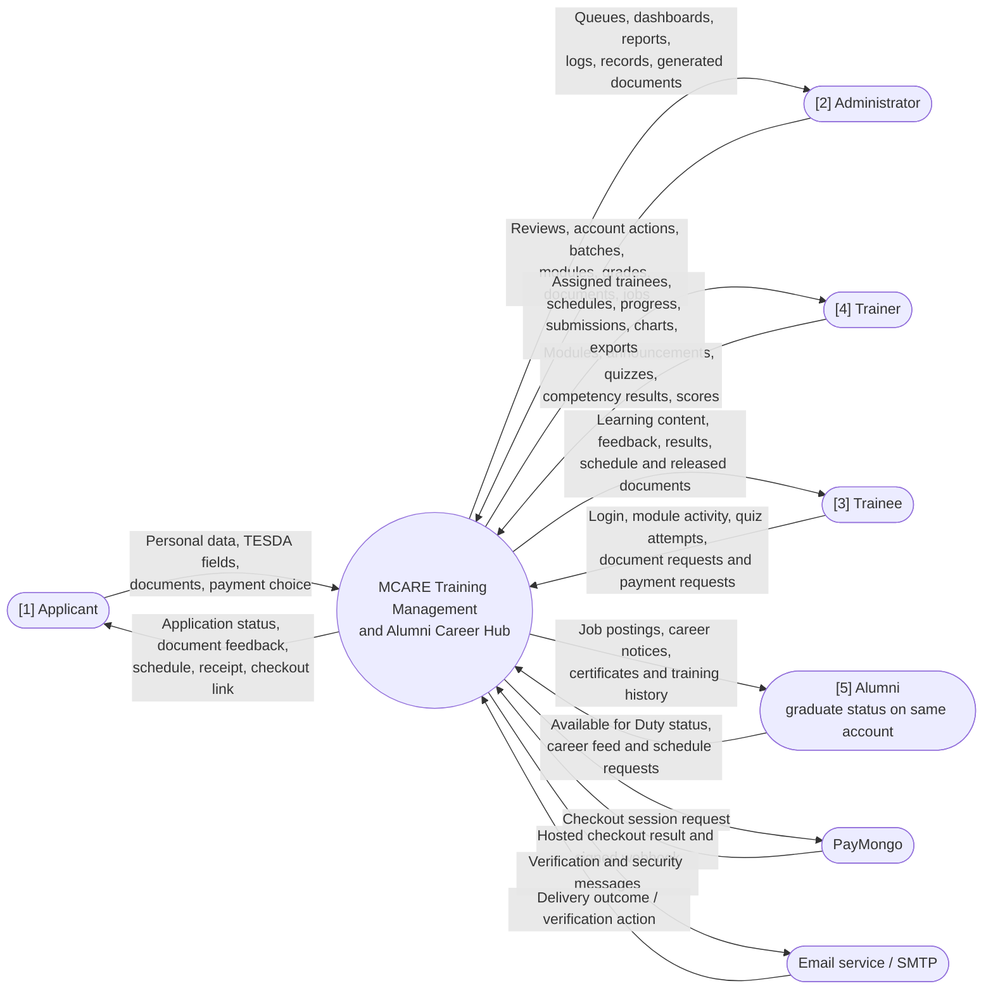
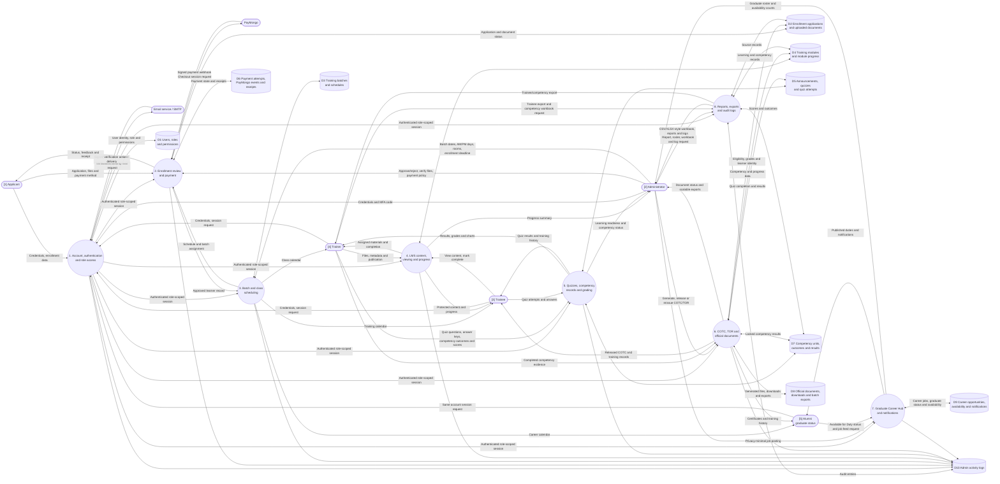
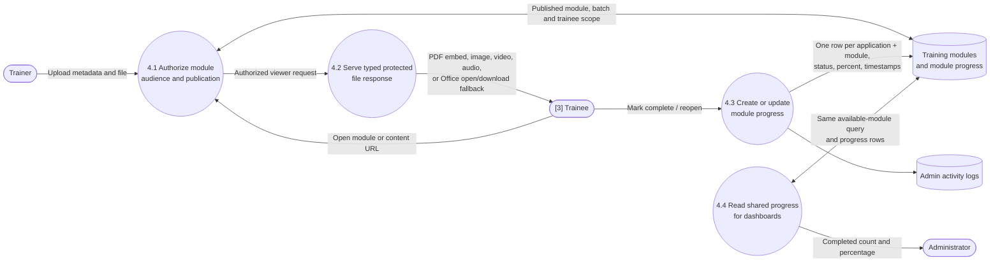
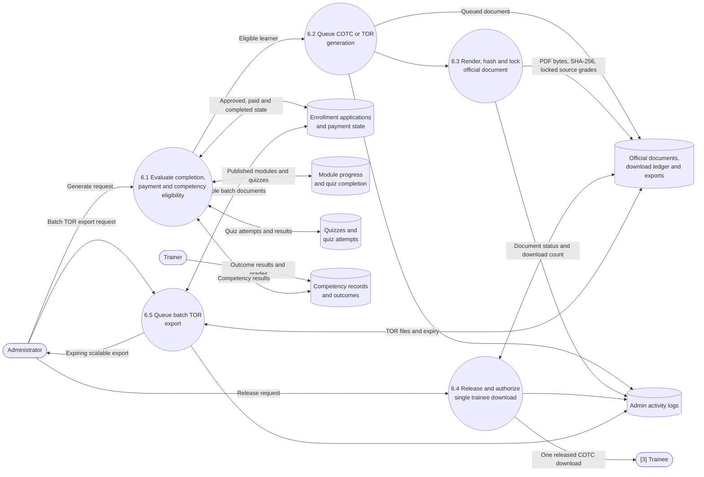
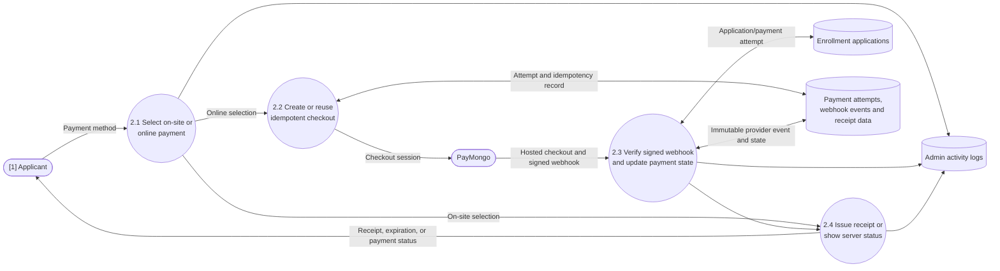

# MCARE Actual Data Flow Diagram

This document is based on the implemented Laravel application in the `65%-prototype` branch. It excludes Docker, hosting, XAMPP, queue infrastructure, and other deployment details because they are not logical MCARE data-flow entities.

## Implementation Boundary Confirmed

The current system has these implemented user-facing actors and workflows:

- Applicant: enrollment form, TESDA registration data, private document uploads, payment selection, PayMongo checkout, and pay-on-site receipt.
- Admin: enrollment review, document verification, account management, batch and AM/PM scheduling, payment scheduling, LMS administration, reports, audit logs, competency records, COTC/TOR generation, and Career Hub administration.
- Trainer: batch trainee roster, announcements, learning-module uploads, quizzes, competency records, achievement/progress charts, exports, and training previews.
- Trainee / Graduate: one authenticated account backed by `EnrollmentApplication`. Active trainees use the LMS, quizzes, payments, and training calendar. A graduate keeps the same account and records, while `learning_status = graduated` unlocks Career Hub and changes the available dashboard features.
- PayMongo: server-created checkout sessions and signed webhook payment updates.
- Email service: account email verification, administrator email two-factor codes, and database-backed notifications where configured.

The implementation has no separate active alumni authentication flow in the logical model. The legacy `/alumni` URLs are compatibility aliases into the shared trainee-based graduate Career Hub.

## Role-Centered View

The following five labels are the user roles/statuses that should be shown in the formal DFD. The numbered labels make the actors easy to identify across Level 0, Level 1, and any recreated diagram.

### Role legend

| Label | User role or status | What the user can do in the implemented system | Main data sent to MCARE | Main data received from MCARE |
| --- | --- | --- | --- | --- |
| **[1] Applicant** | A person who has not yet been approved for training | Complete a Caregiving NC II enrollment application, upload required documents, select on-site or online payment, continue to the payment page, and view the receipt or payment status | Personal/TESDA registration data, privacy consent, document files, password, payment choice | Validation feedback, application/payment continuation, pay-on-site receipt, PayMongo checkout result, status or document feedback |
| **[2] Administrator** | Staff member with administrative access and email two-factor verification | Review applications and documents, approve or reject applicants, manage accounts, batches, schedules, payments, modules, reports, competency records, official documents, job postings, notifications, and audit logs | Review decisions, schedules, account changes, module settings, grading/document actions, job postings, report/export requests | Queues, dashboards, progress summaries, payment/application records, generated COTC/TOR files, exports, logs, and notifications |
| **[3] Trainee** | Approved learner with an active training status | Sign in, view the training stream, schedule, modules and protected files, mark modules complete, take quizzes, view results, maintain documents, and view payment/COTC information | Login/session request, module completion, quiz attempts, document requests, payment/receipt requests | Assigned training content, announcements, schedule, quiz results, progress, feedback, and released documents |
| **[4] Trainer** | Training staff assigned to trainees or batches | View assigned trainees and schedules, publish modules and resources, post announcements, create quizzes, enter competency/achievement/progress records, review results, and export trainee or competency workbooks | Learning files and metadata, announcements, quiz questions/keys, scores, competency outcomes, export requests | Roster, batch schedule, submissions, trainee progress, results, charts, and generated workbooks |
| **[5] Alumni** | A graduate status on the same trainee account; not a separate login | Open Career Hub, mark **Available for Duty**, read privacy-minimal job opportunities, view career-related schedule/notifications, and retain profile, certificates, completed training, and history | Availability status, career feed requests, profile/session requests | Job postings, career schedules, notifications, certificates, completed training, and training history; active-training-only features are hidden |

### Important role/status rule

`[5] Alumni` is included as a user-facing DFD actor because it has a distinct post-graduation flow. In the implementation, the person keeps the same `users` record, password, account, dashboard layout, enrollment history, and documents. MCARE determines graduate access from the approved `EnrollmentApplication.learning_status = graduated`; it does not create a second alumni account, password, or authentication system. The legacy `alumni` role value is supported only for compatibility with older records.

### Role permission key

The logical DFD should show capabilities rather than every route. The current permission groups behind those capabilities are:

| User | Implemented permission examples |
| --- | --- |
| **[1] Applicant** | `enrollment.submit`, `payments.view` |
| **[2] Administrator** | `admin.access`, `enrollments.review`, `payments.verify`, `schedules.manage`, `modules.manage`, `official-documents.manage`, `accounts.manage`, `reports.export`, `logs.view`, `alumni.jobs.manage` |
| **[3] Trainee** | `trainee.access`, `modules.view`, `announcements.view`, `quizzes.take`, `progress.update`, `grades.view`, `documents.view`, `cotc.download`, `payments.view` |
| **[4] Trainer** | `trainer.access`, `trainees.view`, `modules.publish`, `quizzes.manage`, `grades.view`, `competencies.assess`, `trainees.export`, `sessions.view` |
| **[5] Alumni** | Graduate-only `alumni.jobs.view`, plus profile/document/certificate/history access inherited from the shared trainee portal |

### Role and flow diagram

This role-centered diagram is the recommended first page of the formal DFD. It shows what each user does, which MCARE process receives the data, and where the result goes next.

### End-to-end role flows

1. **[1] Applicant flow:** public enrollment form -> server validation and private document storage -> applicant record and enrollment application -> payment selection -> pay-on-site receipt or PayMongo checkout/webhook -> waiting status -> administrator review -> approved trainee access.
2. **[2] Administrator flow:** secure login and two-factor verification -> review application/documents/payment -> approve or reject -> assign/manage batch and AM/PM schedule -> manage accounts and LMS setup -> monitor progress, competency and payments -> generate/release official documents -> publish Career Hub jobs and inspect logs/reports.
3. **[3] Trainee flow:** sign in with the approved account -> open role-aware dashboard -> read stream/schedule -> view assigned modules and files -> mark completion and take quizzes -> receive progress/results -> complete competency requirements -> download released COTC once when eligible.
4. **[4] Trainer flow:** sign in -> open assigned batch/trainee roster -> publish learning modules/resources and announcements -> create quizzes -> record achievement/progress and competency outcomes -> review results -> export competency workbook/chart -> provide completion evidence used by administrative document eligibility.
5. **[5] Alumni flow:** administrator marks the approved enrollment as graduated -> the same trainee account unlocks Career Hub -> alumni updates Available for Duty -> reads privacy-minimal job postings and career notifications -> retains profile, certificates, completed training and history while active training controls, quizzes and payments are hidden.

### DFD symbol legend

| Symbol in the Mermaid diagrams | Meaning in the formal DFD |
| --- | --- |
| Rectangle such as **[1] Applicant** | External user entity that sends data to or receives data from MCARE |
| Circle such as **P3 LMS content** | Logical MCARE process that transforms incoming data into an output |
| Open-ended store such as **D3** | Logical data store/database entity; the name is a grouped view of implemented tables/models |
| Labeled solid arrow | A named data flow; the label describes the payload or business result |
| **PayMongo** or **Email service** box | External service outside MCARE that exchanges data with the system |
| `[5] Alumni` note | A status-based view of the same trainee account, not a second authentication boundary |

For a formal diagramming tool, keep external entities outside the MCARE boundary, processes inside the boundary, and data stores below or beside the processes. Do not draw a direct user-to-database arrow: all role actions must pass through an MCARE process and its authorization rules.

## Level 0: Context Diagram

### Context flow explanation

MCARE is the single system boundary. Applicants submit their own enrollment records, while trainees and graduates consume the records that MCARE releases to them. Administrators and trainers maintain operational and educational records. PayMongo is the external payment provider; it is never trusted to update payment state through a browser return alone. The email service delivers verification and security messages, while MCARE remains responsible for validating signed links and persisting the resulting state.

## Level 1: Major MCARE Processes and Data Stores

### Level 1 process notes

1. **Account, authentication and role access** reads the existing `users` and Spatie role/permission tables. Admin login also uses an email two-factor step. The trainee and graduate distinction is read from the approved enrollment application's `learning_status`, not a second alumni login.
2. **Enrollment review and payment** uses `EnrollmentApplication`, its private upload paths, `PaymentAttempt`, and `PaymongoWebhookEvent`. PayMongo webhooks are signed and idempotent; a browser return does not mark an online payment as paid.
3. **Batch and class scheduling** uses `TrainingBatch`, including enrollment deadlines, training boundaries, AM/PM day patterns, times, and rooms. Related records are checked before a batch can be deleted.
4. **LMS content, viewing and progress** uses `TrainingModule` and `ModuleProgress`. Audience, publication, availability, batch, and trainee authorization are checked on the server.
5. **Quizzes, competency records and grading** uses `Quiz`, `QuizQuestion`, `QuizAttempt`, `CompetencyUnit`, `CompetencyOutcome`, `TraineeCompetencyRecord`, and `TraineeOutcomeResult`.
6. **COTC, TOR and official documents** uses `OfficialDocument`, `OfficialDocumentDownload`, and `BatchDocumentExport`. The eligibility service combines payment, completion, published module progress, quiz results, and competency outcomes before generation.
7. **Graduate Career Hub and notifications** uses `CareerOpportunity`, `AlumniProfile`, and Laravel `notifications`. Job data is intentionally limited to estimated start date, patient gender, mobility, age, contraptions, and a basic care context.
8. **Reports, exports and audit logs** uses the source records plus `AdminActivityLog`. Exports are role-scoped and document downloads are throttled.

## Level 2A: LMS Module Completion and File Access

This decomposition is justified because the Mark as Done defect crosses the button, route, authorization, progress persistence, and admin summary.

The completion action is a `PATCH` to `trainee.modules.progress`. It uses `firstOrCreate` on the application/module pair, then updates the existing row. The response redirects explicitly to the module viewer instead of relying on the browser referrer, so a protected file request cannot accidentally become the completion action. The admin roster uses the same `TrainingModule::availableTo()` scope and the same `ModuleProgress` rows.

Supported upload and viewer behavior:

- PDF: inline PDF viewer.
- JPG, JPEG, PNG, WEBP, GIF: responsive image viewer.
- MP4, WEBM, MOV: HTML video player.
- MP3, WAV, M4A, OGG: HTML audio player.
- PPT, PPTX, DOC, DOCX: validated upload with open/download fallback because reliable inline browser rendering is not assumed.

## Level 2B: Official Documents and Scalable TOR Output

Generation is asynchronous in the implementation, and the document renderer uses server-controlled templates. The logical DFD treats rendering as part of MCARE; BrowserShot is an implementation detail of that internal process, not an external actor. COTC trainee downloads are recorded atomically. TOR generation, release, download, reissue, and batch export remain administrator-only.

## Level 2C: PayMongo Payment Confirmation

## Formal Diagramming Guide

When recreating these diagrams in a formal tool:

- Use rounded rectangles or circles for processes.
- Use rectangles for external entities: Applicant, Administrator, Trainer, Trainee/Graduate, PayMongo, and Email service.
- Use open-ended or parallel-line data-store symbols for the ten logical stores in Level 1.
- Label every arrow with a noun phrase describing the data, not only an action. Examples: `Enrollment application`, `Signed payment webhook`, `Module progress`, `Competency results`, and `Generated COTC/TOR PDF`.
- Keep the same-account Graduate decision visible near Account Access or Career Hub. Do not draw a separate alumni login database.
- Do not draw Docker, XAMPP, MySQL, browsers, Blade, Vite, or hosting as logical entities. They are implementation/deployment concerns rather than MCARE business data flows.

## Verification Notes

The diagrams were reconciled against the current routes, controllers, models, migrations, services, and tests. The current automated suite passes with 125 tests and 851 assertions. PayMongo and email delivery still require their production environment secrets and provider configuration before a live deployment can be claimed.
